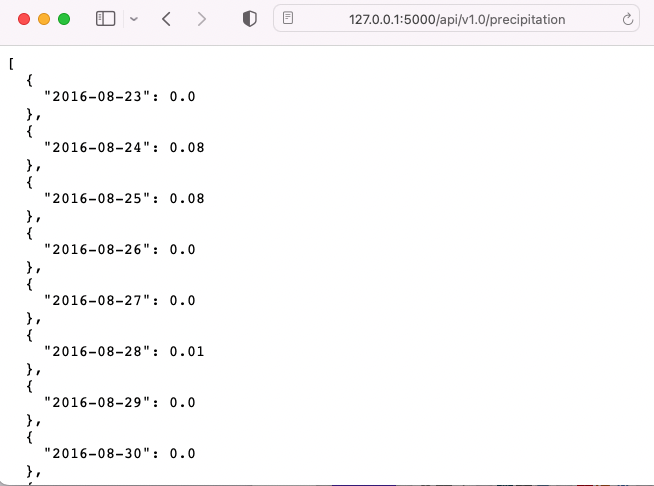

# Climate Analysis - Surf’s Up

Author: Rosie Gianan, gianr00@gmail.com

Build With: Python, SQLAlchemy ORM queries, Pandas, Matplotlib, Flasks API, Python, and JSON.

## Goals:
1.    Perform the climate analysis, data exploration and design of climate app using the data from climate database. 
2.    Perform an analysis using t-test to determine whether the difference in means, if any, is statistically significant. 
3.    Conduct an analysis using the historical data in the dataset, to find out what the temperature has previously been for a timeframe. 

## Solutions:
1.    Climate analysis and data exploration
-   Precipitation analysis  - design the query to analyze the precipitation data using the date and prcp for the previous 12 months of precipitation data. Save the result in Pandas DataFrame and plot the result in a bar chart.

Precipitation analysis chart:

 

-   Station Analysis - design the query to calculate the lowest, highest, and average temperatures for the most active stations and for last 12 months of data. Using the most active station, design a query to retrieve the last 12 months of tobs (temperature observation data). Plot the result in a histogram chart.

Station analysis chart:

2.    Climate app  – Design a Flask API to display the climate data using the following route:

 

-    Precipitation route - Returns the jsonified precipitation data for the last year in the database with the date as the key and the value as the precipitation
 

-    Stations route - Returns jsonified data of all of the stations in the database

-    Tobs route  - Returns the jsonified data for the most active station for the last year of data

-    Dynamic route using the start date - Route accepts start date  as a parameter from the URL. Returns the min, max, and average temperatures calculated from the given start date to the end of the dataset

-    Dynamic route using  the start and end date - Route accepts the start and end dates as parameters from the URL. Returns the min, max, and average temperatures calculated from the given start date to the given end date
 

